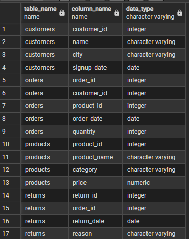

# E-Commerce-Analytics-
SQL portfolio showcasing e-commerce analytics with subqueries, CTEs, CASE WHEN, and joins. Includes 7 business questions, chart-ready queries, and visualizations.
# SQL E-Commerce Analytics Portfolio

## Database Schema



## Files

- `schemas` - Table creation
- `data_insertion` - Sample data
- `queries` - All SQL solutions

## Question 1: Order Details

**Query:**
```sql
SELECT o.order_id, c.name, p.product_name, 
       o.quantity, p.price, 
       (o.quantity * p.price) AS total_price
FROM orders o
JOIN customers c ON o.customer_id = c.customer_id
JOIN products p ON o.product_id = p.product_id;


